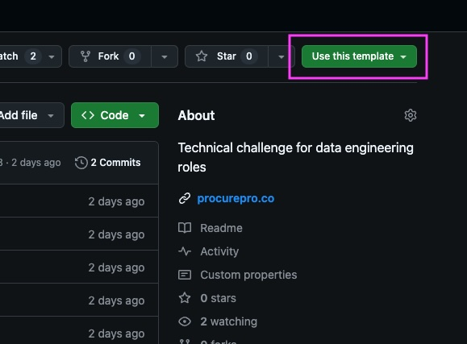
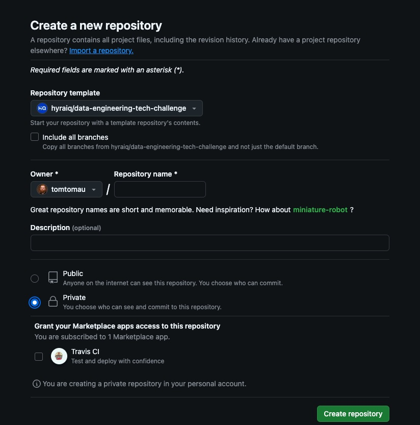

# ProcurePro Data Engineering Tech Challenge

This repo contains the code for the ProcurePro Data Engineering Tech Challenge. The challenge involves:

* developing a plan for building models & metrics in dbt/metricflow as a responses to hypothetical requests from
  ProcurePro team members.
* using this repository to implement some part of your plan in dbt/metricflow.

## Next reading

* [Setup/tooling documentation](doc/setup.md)
* [Further challenge details](doc/challenge.md)

> ⚠️ **Important**
>
> When undertaking this challenge, we ask that you __please do not fork this repository__. Instead, please
> [create a private repository from this template](https://docs.github.com/en/repositories/creating-and-managing-repositories/creating-a-repository-from-a-template).
>
> When you're finished, invite [@tomtomau](https://github.com/tomtomau) to your repository as
> a [collaborator](https://docs.github.com/en/account-and-profile/setting-up-and-managing-your-personal-account-on-github/managing-access-to-your-personal-repositories/inviting-collaborators-to-a-personal-repository).
>
> 
> 