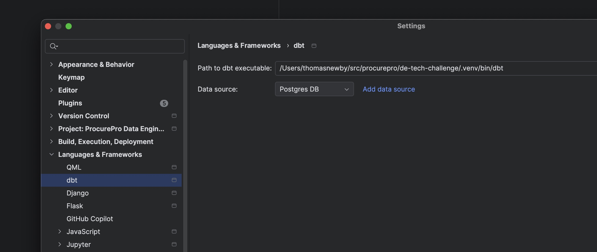

# IDE details

We use the Jetbrains products at ProcurePro - for data stuff we use PyCharm. Committed to this repo in the `.idea`
folder are _some_ configurations that _should_ kinda work out of the box, such as the Postgres database connection (for
username/password details, check the docker compose config).

You're more than welcome to use your own IDE (or Vim, like an absolute legend), but you'll need to sort this stuff out
yourself.

## dbt config in PyCharm

In PyCharm, you can configure dbt such that you can run some dbts commands (run/test/preview) directly from SQL files.

Config that worked for me below (noting you'll need to do the [setup](./setup.md) first to create your `.venv`)

